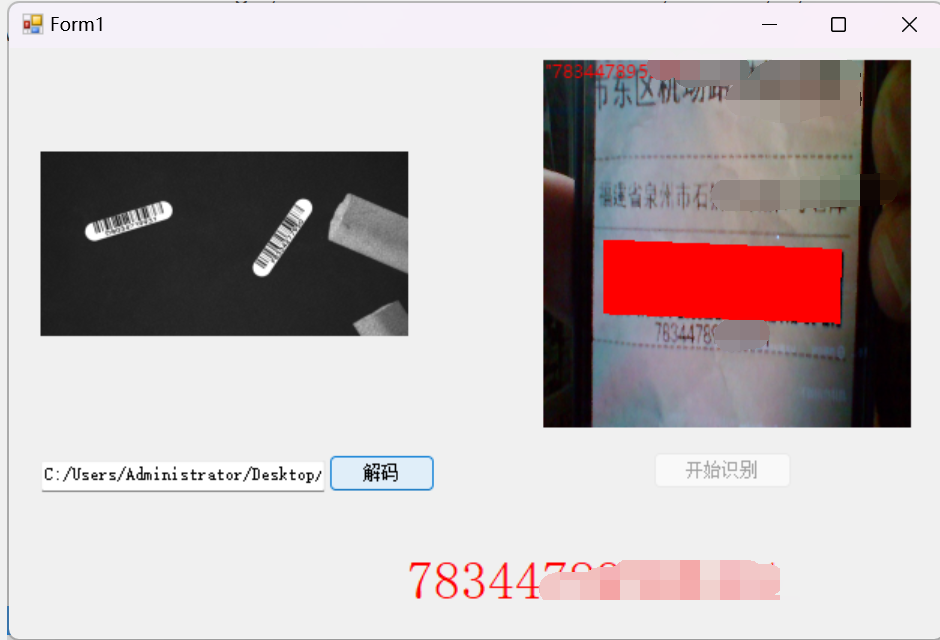

# 基于Halcon识别条形码

## 介绍

*一个小Demo，支持图片以及视频的条形码识别，使用Halcon自带的算子实现，视频模块使用到了AForge.Video，AForge.Video.DirectShow组件*
*  实时捕捉视频显示到picturebox关键代码
```c#
 // 获取可用的视频设备
            videoDevices = new FilterInfoCollection(FilterCategory.VideoInputDevice);
            // 检查是否有可用的摄像头
            if (videoDevices.Count > 0)
            {
                // 创建VideoCaptureDevice对象
                videoSource = new VideoCaptureDevice(videoDevices[0].MonikerString);
                // 设置NewFrame事件处理方法
                videoSource.NewFrame += VideoSource_NewFrame;
                // 启动视频流
                videoSource.Start();
            }
            else
            {
                MessageBox.Show("未检测到可用摄像头。");
            }


        private void VideoSource_NewFrame(object sender, NewFrameEventArgs eventArgs)
        {
            // 在PictureBox上显示图像
            pictureBox1.Image = (System.Drawing.Image)eventArgs.Frame.Clone();
        }
```

*  Halcon识别条形码
```c#
     public string[] decode(PictureBox pcb)
        {
            HObject ho_Image, ho_GrayImage, ho_SymbolRegions;
            HTuple hv_Width = new HTuple(), hv_Height = new HTuple();
            HTuple hv_WindowHandle = new HTuple(), hv_BarCodeHandle = new HTuple();
            HTuple hv_DecodedDataStrings = new HTuple();
            // Initialize local and output iconic variables 
            HOperatorSet.GenEmptyObj(out ho_Image);
            HOperatorSet.GenEmptyObj(out ho_GrayImage);
            HOperatorSet.GenEmptyObj(out ho_SymbolRegions);
            if (HDevWindowStack.IsOpen())
            {
                HOperatorSet.CloseWindow(HDevWindowStack.Pop());
            }
            if (HDevWindowStack.IsOpen())
            {
                HOperatorSet.ClearWindow(HDevWindowStack.GetActive());
            }
            ho_Image.Dispose();

            // 将 PictureBox 中的图像转换为 Halcon 图像对象
            // 将 PictureBox 中的图像转换为 Bitmap 对象
            Bitmap bitmap = new Bitmap(pcb.Image);

            // 获取 Bitmap 对象的相关信息
            int width = bitmap.Width;
            int height = bitmap.Height;
            Rectangle rect = new Rectangle(0, 0, width, height);
            System.Drawing.Imaging.BitmapData bmpData =
                bitmap.LockBits(rect, System.Drawing.Imaging.ImageLockMode.ReadOnly,
                System.Drawing.Imaging.PixelFormat.Format24bppRgb);

            try
            {
                // 创建 Halcon 图像对象
                IntPtr pixelData = bmpData.Scan0;
                HOperatorSet.GenImageInterleaved(out ho_Image, pixelData, "bgr", width, height, -1,
                    "byte", width, height, 0, 0, 8, 0);
            }
            finally
            {
                // 释放 Bitmap 对象的锁定
                bitmap.UnlockBits(bmpData);
            }

            //通过PictureBox打开窗口
            HOperatorSet.OpenWindow(0, 0, pcb.Width, pcb.Height, pcb.Handle, "visible", "", out WindowHandle);
            //将创建好的窗口压入窗口栈中
            HDevWindowStack.Push(WindowHandle);
            // HOperatorSet.ReadImage(out ho_Image, path);


            ho_GrayImage.Dispose();

            HOperatorSet.Rgb1ToGray(ho_Image, out ho_GrayImage);

            hv_Width.Dispose(); hv_Height.Dispose();
            HOperatorSet.GetImageSize(ho_GrayImage, out hv_Width, out hv_Height);

            HOperatorSet.SetWindowAttr("background_color", "red");
            //创建条形码模型
            hv_BarCodeHandle.Dispose();
            HOperatorSet.CreateBarCodeModel("element_size_min", 1.0, out hv_BarCodeHandle);
            //从创建好的条形码句柄中寻找条形码
            ho_SymbolRegions.Dispose();
            hv_DecodedDataStrings.Dispose();
            HOperatorSet.FindBarCode(ho_GrayImage, out ho_SymbolRegions, hv_BarCodeHandle,
                "auto", out hv_DecodedDataStrings);
            //显示结果,先判断是否打开开发窗口
            if (HDevWindowStack.IsOpen()) {
                HOperatorSet.ClearWindow(WindowHandle);
                HOperatorSet.SetColor(WindowHandle, "red");
                HOperatorSet.DispObj(ho_Image, WindowHandle);
                HOperatorSet.DispRegion(ho_SymbolRegions, WindowHandle);
                HOperatorSet.WriteString(WindowHandle, hv_DecodedDataStrings.ToString());
            }
            ho_Image.Dispose();
            ho_GrayImage.Dispose();
            ho_SymbolRegions.Dispose();
            hv_Width.Dispose();
            hv_Height.Dispose();
            hv_WindowHandle.Dispose();
            hv_BarCodeHandle.Dispose();
            hv_DecodedDataStrings.Dispose();
            return hv_DecodedDataStrings;

        }
```
## 图片




